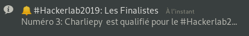

# Whatsmatter HDN (HackerLab Desktop Notification)

Python program used to inform in real time by desktop notification of Qualifiers for the final phase of ```#HackerLab2019```.

<div style="text-align:center"></div>

## Available for linux OS  
> The program is launched as a daemon in the background of the system. Once a person is able to register for the final phase of the hackerlab, you will automatically receive a notification. It is important that the program is first launched

---
## Dependencies
```console
$ pip3 install notify2  
$ pip3 install requests  
$ pip3 install emojis  
```
## Run
```console
$ git clone https://github.com/CharliGithub/whatsmatter.git
$ python3 whatsmatter.py &
```
